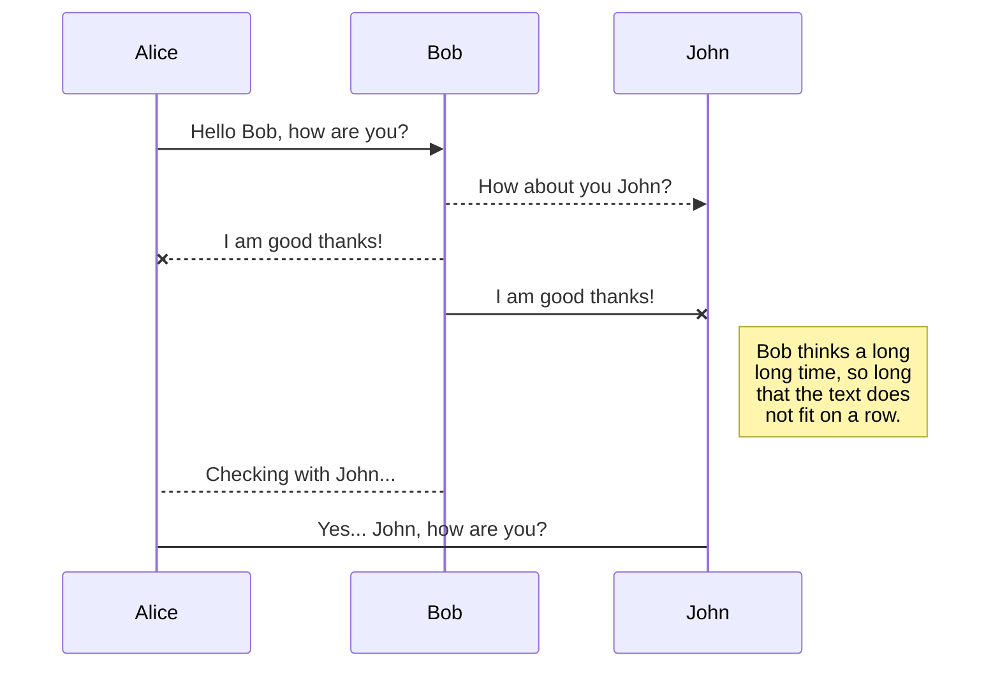
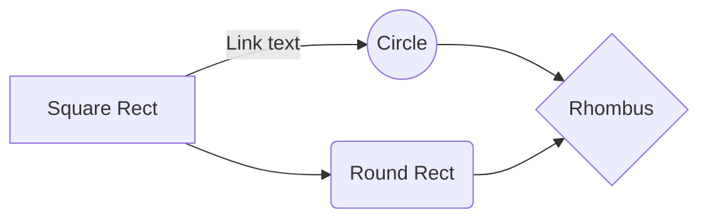

# Actividad de Exploración

# Proyecto: Plataforma de Gestión de Eventos y Conferencias

---

# Introducción

La organización de eventos y conferencias ha evolucionado gracias al uso de herramientas tecnológicas que permiten planificar, administrar y controlar todas las actividades de manera más eficiente. Una plataforma de gestión de eventos facilita tareas como el registro de asistentes, la programación de actividades, la venta de entradas y la comunicación entre organizadores y participantes.

Actualmente, estas plataformas son utilizadas por empresas, universidades, organizaciones y entidades gubernamentales para realizar eventos presenciales, virtuales e híbridos, mejorando la experiencia de todos los involucrados.

---

# 1. Conceptos importantes y relevantes en la temática

## ¿Qué es una Plataforma de Gestión de Eventos y Conferencias?

Una plataforma de gestión de eventos es un sistema informático diseñado para planificar, organizar, administrar y controlar eventos de cualquier tamaño, como congresos, seminarios, conferencias, ferias, capacitaciones y reuniones empresariales.

Su objetivo principal es centralizar toda la información del evento en un solo lugar para facilitar el trabajo de los organizadores y brindar una mejor experiencia a los asistentes.

---

## Conceptos importantes

### Gestión de eventos

Es el proceso de planificar, organizar, ejecutar y evaluar un evento para cumplir los objetivos establecidos.

### Registro de asistentes

Permite que las personas se inscriban al evento mediante formularios digitales y almacena toda la información de los participantes.

### Venta de entradas

Algunas plataformas permiten vender boletos en línea y controlar los pagos de manera automática.

### Agenda o cronograma

Organiza todas las actividades del evento, indicando horarios, conferencias, talleres y ponencias.

### Gestión de ponentes

Permite administrar la información de los conferencistas, sus horarios, biografías y presentaciones.

### Control de acceso

Utiliza códigos QR, credenciales digitales o aplicaciones móviles para registrar la entrada de los asistentes de forma rápida y segura.

### Eventos virtuales

Son eventos realizados completamente en línea mediante plataformas de videoconferencia y transmisión en vivo.

### Eventos híbridos

Combinan asistentes presenciales y asistentes virtuales, permitiendo una mayor participación.

### Reportes y estadísticas

Las plataformas generan información sobre la cantidad de asistentes, ventas, participación y resultados del evento para apoyar la toma de decisiones.

---

## Beneficios de utilizar una plataforma de gestión de eventos

- Reduce el tiempo de organización.
- Automatiza tareas repetitivas.
- Disminuye errores administrativos.
- Facilita la comunicación entre organizadores y asistentes.
- Mejora la experiencia de los participantes.
- Permite realizar eventos presenciales, virtuales e híbridos.
- Genera reportes útiles para mejorar futuros eventos.

---

# 2. Tendencias actuales en las plataformas de gestión de eventos

La tecnología ha cambiado la forma en que se organizan los eventos. Actualmente existen diversas tendencias que mejoran la eficiencia y la experiencia de los usuarios.

## Eventos híbridos

Cada vez es más común combinar asistentes presenciales con participantes conectados por internet. Esto permite ampliar el alcance del evento y reducir costos de desplazamiento.

---

## Inteligencia Artificial (IA)

Muchas plataformas incorporan herramientas de IA para:

- Responder preguntas mediante chatbots.
- Recomendar conferencias según los intereses del usuario.
- Automatizar registros.
- Analizar datos del evento.

---

## Aplicaciones móviles

Las aplicaciones permiten a los asistentes:

- Consultar el programa.
- Recibir notificaciones.
- Descargar certificados.
- Ver mapas del lugar.
- Comunicarse con otros participantes.

---

## Networking inteligente

Las plataformas ayudan a conectar asistentes con intereses similares para facilitar oportunidades de negocio y colaboración.

---

## Analítica de datos

Las organizaciones utilizan reportes para conocer:

- Número de asistentes.
- Tiempo de permanencia.
- Conferencias con mayor participación.
- Nivel de satisfacción.
- Resultados de encuestas.

Estos datos permiten mejorar la planificación de futuros eventos.

---

## Registro sin contacto

Después de la pandemia se volvió muy común utilizar:

- Códigos QR.
- Credenciales digitales.
- Check-in desde aplicaciones móviles.

Esto hace el ingreso más rápido y seguro.

---

## Integración con otras herramientas

Las plataformas actuales pueden conectarse con:

- Google Calendar.
- Outlook.
- Zoom.
- Microsoft Teams.
- Sistemas de pago.
- Redes sociales.

Esto facilita la organización completa del evento.

---

# 3. Consulta y análisis de al menos dos herramientas existentes en el mercado

## Herramienta 1: Eventbrite

### Descripción

Eventbrite es una de las plataformas más conocidas para organizar eventos. Permite crear eventos, vender entradas y administrar asistentes de forma sencilla.

### Características

- Registro de asistentes.
- Venta de entradas.
- Control de pagos.
- Promoción del evento.
- Gestión de invitaciones.
- Estadísticas básicas.
- Escaneo de códigos QR.

### Ventajas

- Fácil de utilizar.
- Interfaz intuitiva.
- Disponible en muchos países.
- Ideal para eventos pequeños y medianos.
- Buena integración con redes sociales.

### Desventajas

- Algunas funciones son de pago.
- Cobra comisiones por algunas ventas de entradas.
- Las funciones avanzadas son limitadas frente a plataformas empresariales.

---

## Herramienta 2: Cvent

### Descripción

Cvent es una plataforma profesional utilizada por empresas, universidades y organizaciones para administrar eventos de gran tamaño.

### Características

- Gestión completa de eventos.
- Registro personalizado.
- Agenda interactiva.
- Aplicación móvil.
- Eventos presenciales, virtuales e híbridos.
- Reportes avanzados.
- Integración con sistemas empresariales.

### Ventajas

- Muy completa.
- Alta seguridad.
- Excelente para eventos grandes.
- Gran capacidad de personalización.
- Amplias herramientas de análisis.

### Desventajas

- Precio elevado.
- Requiere capacitación para aprovechar todas sus funciones.
- No es la mejor opción para eventos pequeños.

---

# Comparación entre las herramientas

| Característica | Eventbrite | Cvent |
|----------------|------------|--------|
| Facilidad de uso | Muy alta | Media |
| Registro de asistentes | Sí | Sí |
| Venta de entradas | Sí | Sí |
| Eventos virtuales | Sí | Sí |
| Eventos híbridos | Sí | Sí |
| Reportes | Básicos | Avanzados |
| Aplicación móvil | Sí | Sí |
| Ideal para | Eventos pequeños y medianos | Eventos grandes y corporativos |
| Precio | Medio | Alto |

---

# Análisis

Las dos plataformas cumplen el objetivo de facilitar la organización de eventos, pero están dirigidas a diferentes tipos de usuarios.

Eventbrite destaca por ser sencilla, rápida de configurar y adecuada para personas o pequeñas organizaciones que desean administrar eventos sin conocimientos técnicos avanzados.

Por otro lado, Cvent ofrece una solución mucho más completa para empresas y organizaciones que realizan congresos o conferencias de gran tamaño y necesitan funciones avanzadas como análisis de datos, personalización e integración con otros sistemas.

La elección dependerá del tamaño del evento, el presupuesto disponible y las necesidades específicas de los organizadores.

---

# Conclusiones

- Las plataformas de gestión de eventos permiten organizar conferencias, congresos y reuniones de manera eficiente.
- Automatizan procesos como el registro de asistentes, el control de acceso y la programación de actividades.
- Las tendencias actuales incluyen inteligencia artificial, eventos híbridos, aplicaciones móviles y análisis de datos.
- Eventbrite es una excelente opción para eventos pequeños y medianos debido a su facilidad de uso.
- Cvent es una plataforma más robusta orientada a organizaciones que necesitan administrar eventos de gran escala.
- La implementación de estas plataformas mejora la experiencia de los asistentes y optimiza el trabajo de los organizadores.

---

# Bibliografía

Cvent. (s.f.). *Cvent Event Management Platform*. https://www.cvent.com/

Eventbrite. (s.f.). *Eventbrite*. https://www.eventbrite.com/

MeetingsNet. (2025). *Event Technology Trends*. https://www.meetingsnet.com/

PCMA. (2025). *Professional Convention Management Association*. https://www.pcma.org/

# Welcome to StackEdit!

Hi! I'm your first Markdown file in **StackEdit**. If you want to learn about StackEdit, you can read me. If you want to play with Markdown, you can edit me. Once you have finished with me, you can create new files by opening the **file explorer** on the left corner of the navigation bar.

# Files

StackEdit stores your files in your browser, which means all your files are automatically saved locally and are accessible **offline!**

## Create files and folders

The file explorer is accessible using the button in left corner of the navigation bar. You can create a new file by clicking the **New file** button in the file explorer. You can also create folders by clicking the **New folder** button.

## Switch to another file

All your files and folders are presented as a tree in the file explorer. You can switch from one to another by clicking a file in the tree.

## Rename a file

You can rename the current file by clicking the file name in the navigation bar or by clicking the **Rename** button in the file explorer.

## Delete a file

You can delete the current file by clicking the **Remove** button in the file explorer. The file will be moved into the **Trash** folder and automatically deleted after 7 days of inactivity.

## Export a file

You can export the current file by clicking **Export to disk** in the menu. You can choose to export the file as plain Markdown, as HTML using a Handlebars template or as a PDF.

# Synchronization

Synchronization is one of the biggest features of StackEdit. It enables you to synchronize any file in your workspace with other files stored in your **Google Drive**, your **Dropbox** and your **GitHub** accounts. This allows you to keep writing on other devices, collaborate with people you share the file with, integrate easily into your workflow... The synchronization mechanism takes place every minute in the background, downloading, merging, and uploading file modifications.

There are two types of synchronization and they can complement each other:

- The workspace synchronization will sync all your files, folders and settings automatically. This will allow you to fetch your workspace on any other device.
	> To start syncing your workspace, just sign in with Google in the menu.

- The file synchronization will keep one file of the workspace synced with one or multiple files in **Google Drive**, **Dropbox** or **GitHub**.
	> Before starting to sync files, you must link an account in the **Synchronize** sub-menu.

## Open a file

You can open a file from **Google Drive**, **Dropbox** or **GitHub** by opening the **Synchronize** sub-menu and clicking **Open from**. Once opened in the workspace, any modification in the file will be automatically synced.

## Save a file

You can save any file of the workspace to **Google Drive**, **Dropbox** or **GitHub** by opening the **Synchronize** sub-menu and clicking **Save on**. Even if a file in the workspace is already synced, you can save it to another location. StackEdit can sync one file with multiple locations and accounts.

## Synchronize a file

Once your file is linked to a synchronized location, StackEdit will periodically synchronize it by downloading/uploading any modification. A merge will be performed if necessary and conflicts will be resolved.

If you just have modified your file and you want to force syncing, click the **Synchronize now** button in the navigation bar.

> **Note:** The **Synchronize now** button is disabled if you have no file to synchronize.

## Manage file synchronization

Since one file can be synced with multiple locations, you can list and manage synchronized locations by clicking **File synchronization** in the **Synchronize** sub-menu. This allows you to list and remove synchronized locations that are linked to your file.

# Publication

Publishing in StackEdit makes it simple for you to publish online your files. Once you're happy with a file, you can publish it to different hosting platforms like **Blogger**, **Dropbox**, **Gist**, **GitHub**, **Google Drive**, **WordPress** and **Zendesk**. With [Handlebars templates](http://handlebarsjs.com/), you have full control over what you export.

> Before starting to publish, you must link an account in the **Publish** sub-menu.

## Publish a File

You can publish your file by opening the **Publish** sub-menu and by clicking **Publish to**. For some locations, you can choose between the following formats:

- Markdown: publish the Markdown text on a website that can interpret it (**GitHub** for instance),
- HTML: publish the file converted to HTML via a Handlebars template (on a blog for example).

## Update a publication

After publishing, StackEdit keeps your file linked to that publication which makes it easy for you to re-publish it. Once you have modified your file and you want to update your publication, click on the **Publish now** button in the navigation bar.

> **Note:** The **Publish now** button is disabled if your file has not been published yet.

## Manage file publication

Since one file can be published to multiple locations, you can list and manage publish locations by clicking **File publication** in the **Publish** sub-menu. This allows you to list and remove publication locations that are linked to your file.

# Markdown extensions

StackEdit extends the standard Markdown syntax by adding extra **Markdown extensions**, providing you with some nice features.

> **ProTip:** You can disable any **Markdown extension** in the **File properties** dialog.

## SmartyPants

SmartyPants converts ASCII punctuation characters into "smart" typographic punctuation HTML entities. For example:

|                |ASCII                          |HTML                         |
|----------------|-------------------------------|-----------------------------|
|Single backticks|`'Isn't this fun?'`            |'Isn't this fun?'            |
|Quotes          |`"Isn't this fun?"`            |"Isn't this fun?"            |
|Dashes          |`-- is en-dash, --- is em-dash`|-- is en-dash, --- is em-dash|

## KaTeX

You can render LaTeX mathematical expressions using [KaTeX](https://khan.github.io/KaTeX/):

The *Gamma function* satisfying $\Gamma(n) = (n-1)!\quad\forall n\in\mathbb N$ is via the Euler integral

$$
\Gamma(z) = \int_0^\infty t^{z-1}e^{-t}dt\,.
$$

> You can find more information about **LaTeX** mathematical expressions [here](http://meta.math.stackexchange.com/questions/5020/mathjax-basic-tutorial-and-quick-reference).

## UML diagrams

You can render UML diagrams using [Mermaid](https://mermaidjs.github.io/). For example, this will produce a sequence diagram:

And this will produce a flow chart:

